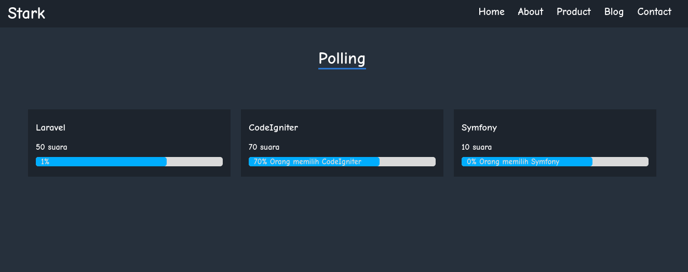

# PHP MVC Poll System

### Preview

### Cara penggunaan :
1. Buat database
2. Import database dari file [polling.sql](polling.sql)
3. Edit file [config.php](app/config/config.php) dan sesuaikan dengan database. Edit juga configurasi SMTP nya

### Dibangun dengan :
1. PHP MVC (native)
2. HTML, CSS, JS (native)
3. MySQL
4. Library : PHPSpreadsheet & PHPMailer

## Author :

- Fb : [AJID STARK](https://fb.me/ajidstark)
- Twitter : [@ajidstark](https://twitter.com/ajidstark)
- LinkedIn : [Yusuf Al Majid](https://www.linkedin.com/in/yusuf-al-majid/)
